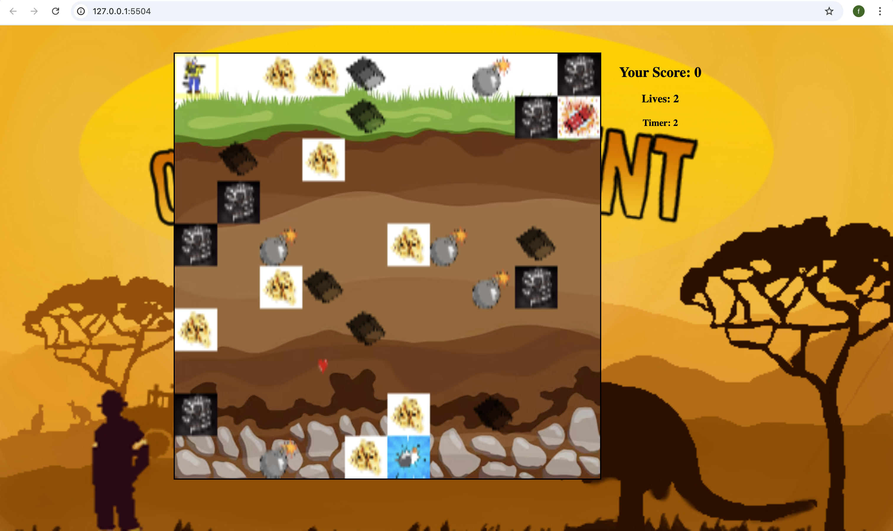

# 🎮 **Game Title** 

> **Short Pitch**: In this fast-paced mining game, you have 10 seconds to memorize the locations of gold, silver, and bombs before they vanish, and then race against time to collect treasures while avoiding deadly bombs.
> 

## 📸 **Screenshots**

### Main Gameplay:

  
  
*Figure 1: 10 seconds of memorising the gamescreen.*

  
  
*Figure 1: gameplay with items covered*

---

### Menu and UI:

  
  
*Figure 2: start page interface.*

---

## 🎨 **Spritesheets**
Below are the sprites used to create characters and objects in the game:

### Player Character:

  
  
*Figure 3: mining character animations.*

---

### Items:

  
  
*Figure 4: cube animation.*

  
  
*Figure 4: extra life animation.*

---

## ✍️ **Reflection**

### What went well:
- **implementation of different objects:** It was easier than expected, to create many objects with different functions.
- **implementing the delay:** It also worked very well to implement the delay, that the surface only appears 10 seconds after the game has started.

### Challenges:
- **bomb detection feature:** Implementing this item/feature took me ages but i got it in the end (with help).
- **creating different levels:** It was pretty hard to create the different randomized maps according to the button, that has been pressed (easy, middle, advanced).

### Lessons Learned:
- **just start:** just start and not think too much in the beginning (once you have a rough plan).
- **not getting stressed at the start:** Don't worry too much at the start, when things don't go that smooth and easy.
